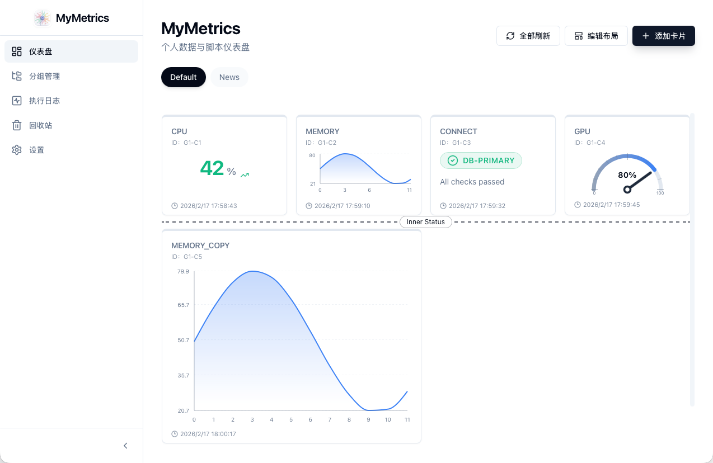
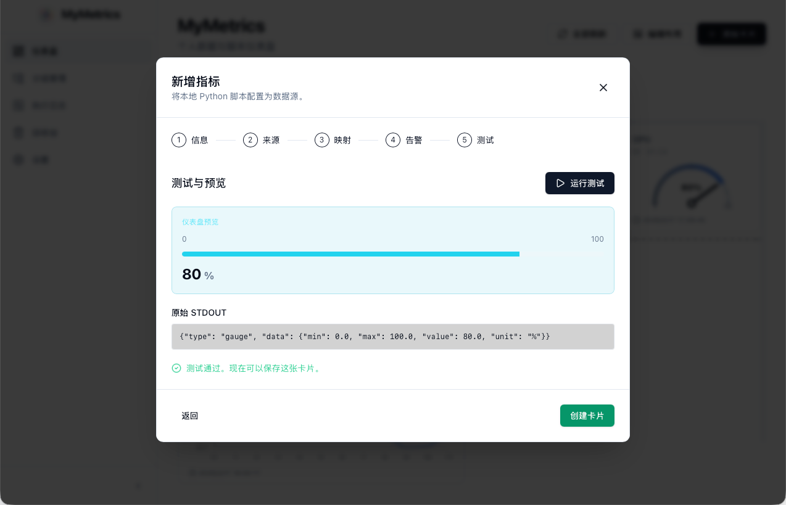
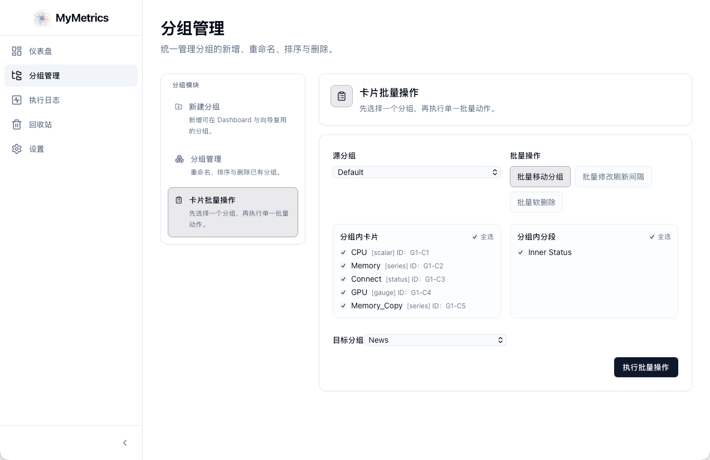
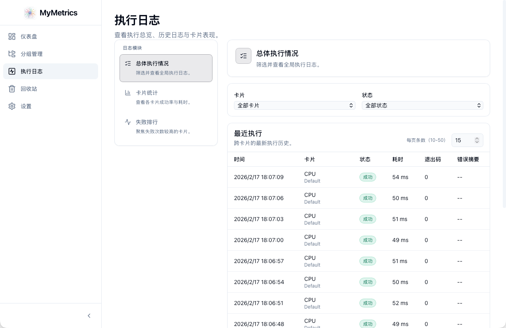
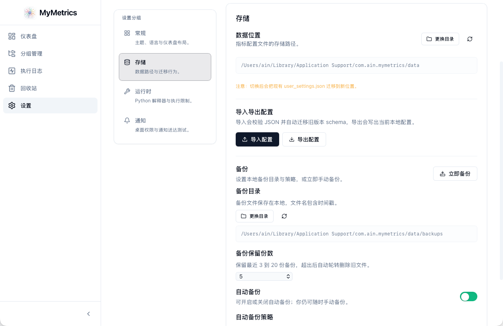
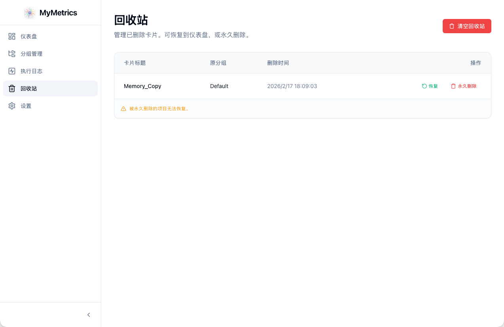
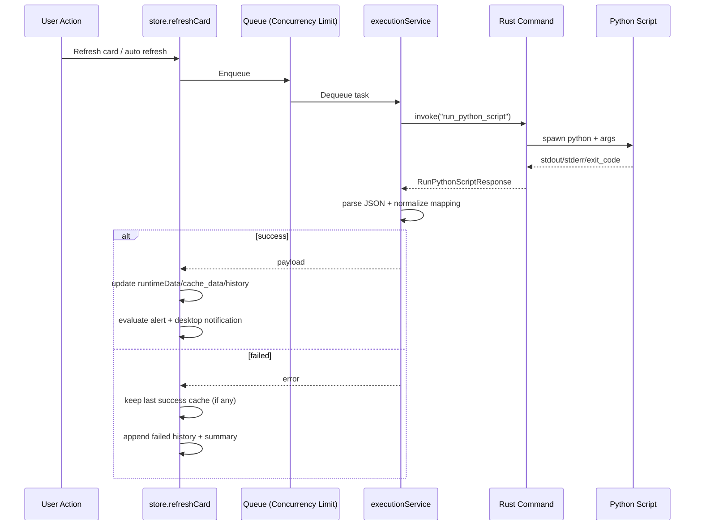
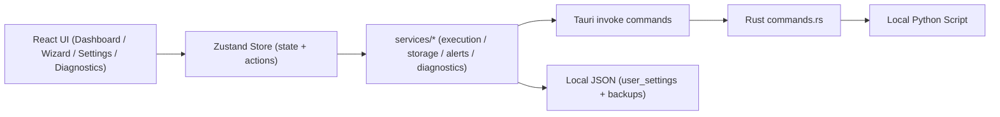

<p align="center">
  
</p>

<h1 align="center">MyMetrics</h1>

<p align="center">
  本地优先的个人数据看板（Local-first Personal Data Dashboard）<br />
  <strong>UI 与数据逻辑解耦：</strong>你写 Python 脚本产数，MyMetrics 负责展示、调度、告警、诊断与持久化。
</p>

<p align="center">
  
  
  
  
  
  
</p>

<p align="center">
  <a href="#quick-start">快速开始</a> ·
  <a href="#features">功能全景</a> ·
  <a href="#screenshots">应用截图</a> ·
  <a href="#data-contract">脚本协议</a> ·
  <a href="#architecture">架构图</a> ·
  <a href="#english-snapshot">English</a>
</p>

---

<p align="center">
  
</p>

<p align="center">
  <em>Dashboard 全景：多卡片、分组导航、分段线与编辑能力</em>
</p>

## ✨ 项目亮点

- **本地优先**：无云端依赖，配置与数据缓存均保存在本机。
- **高度可定制**：每张卡片绑定任意本地 Python 脚本，支持独立解释器、参数与映射。
- **完整运行闭环**：刷新队列、失败回退、执行诊断、阈值/状态告警、桌面通知、备份轮转。
- **面向扩展**：数据 schema 版本迁移、导入导出、分组批处理、布局多作用域（全局/分组）。

<a id="features"></a>
## 🧭 功能全景

| 模块 | 能力 |
| --- | --- |
| Dashboard | 网格看板、全量/单卡刷新、编辑模式、方向键移动、碰撞处理、卡片复制、Section Marker 分段线 |
| Creation Wizard | 5 步向导（基础信息 → 脚本刷新 → 映射 → 告警 → 测试预览），新建/编辑复用 |
| Group Management Center | 分组创建/重命名/排序/删除、分组批量操作（移动分组/更新间隔/脚本路径前缀替换/软删除） |
| Diagnostics | 每卡历史 ring buffer、全局执行记录、成功率、平均耗时、P50/P90、失败热点 |
| Recycle Bin | 软删除回收、还原、永久删除、清空回收站 |
| Settings | 主题/语言、数据目录、导入导出、备份策略、默认 Python、并发限流、历史容量、交互音效、通知权限 |

<a id="screenshots"></a>
## 🖼️ 应用截图

### 向导与分组管理

| Creation Wizard（测试与预览） | Group Management Center（分组批处理） |
| --- | --- |
|  |  |

### 诊断、设置与回收站

| Diagnostics（执行历史与失败分析） | Settings（运行时与备份配置） |
| --- | --- |
|  |  |



<p align="center">
  <em>Recycle Bin：软删除恢复与永久删除管理</em>
</p>

## 🧩 卡片类型

支持 5 类卡片，统一协议但独立映射：

- `scalar`：单值指标（如温度、余额、CPU）
- `series`：时序/序列（单轴单线 / 单轴双线 / 双轴双线）
- `status`：状态卡（`ok/warning/error/unknown`）
- `gauge`：仪表盘（`min/max/value`）
- `digest`：分组文本（`items[].title + items[].body`）

<a id="quick-start"></a>
## 🚀 快速开始

### 1) 环境要求

- Node.js `20+`
- npm `10+`
- Python `3.x`
- Rust toolchain（Tauri 2 必需）

### 2) 安装依赖

```bash
npm install
```

### 3) 运行

仅前端调试（不能真实调用本地 Python）：

```bash
npm run dev
```

Tauri 桌面模式（推荐，完整功能）：

```bash
npm run tauri:dev
```

### 4) 构建与校验

```bash
npm run typecheck
npm run test -- --run
npm run build
npm run tauri:build
```

<a id="data-contract"></a>
## 🧪 脚本协议（Data Contract）

脚本必须向 `stdout` 输出 JSON：

```json
{
  "type": "scalar | series | status | gauge | digest",
  "data": {}
}
```

### 类型字段速查

| type | data 要点 |
| --- | --- |
| `scalar` | `value`（必填），可带 `unit/trend/color` |
| `series` | `x_axis`（数组）+ `series`（数组，元素含 `name/values`）；双线模式固定使用前两条 `series` |
| `status` | `label/state`（必填），可带 `message` |
| `gauge` | `min/max/value`（必填），且 `max > min` |
| `digest` | `items`（数组，元素含 `title/body`） |

### Series 子模式说明

- `single_axis_single_line`：左侧单 Y 轴，绘制第 1 条线。
- `single_axis_double_line`：左侧单 Y 轴，绘制前 2 条线并显示图例。
- `dual_axis_double_line`：左右双 Y 轴，前 2 条线分别绑定左右轴并显示图例。
- 当卡片配置为双线但脚本只返回 1 条线时，会自动回退单线并给出提示。

### 协议补充规则

- 映射支持点路径：如 `metrics.cpu.value`
- `status.state` 别名归一化：
  - `success/healthy -> ok`
  - `warn -> warning`
  - `critical/danger -> error`
- 脚本执行超时在 Rust 侧强制约束为 `1000ms ~ 120000ms`
- 校验脚本必须是存在的 `.py` 文件

完整示例见：[`docs/脚本数据协议与示例.md`](docs/脚本数据协议与示例.md)

## 🔄 执行链路



<a id="architecture"></a>
## 🧱 架构图



## 🗂️ 关键模块

| 文件 | 作用 |
| --- | --- |
| `App.tsx` | 应用壳层：初始化、自动保存、刷新调度、自动备份、窗口自适应、音效绑定 |
| `store.ts` | 全局状态与业务动作中心（卡片/分组/布局/回收站/设置/队列/告警） |
| `services/execution.ts` | 脚本执行、输出校验、mapping 归一化、脚本预校验 |
| `services/storage.ts` | 持久化、schema 迁移、导入导出、备份轮转、路径解析 |
| `services/alerts.ts` | 状态变更/阈值告警计算与 cooldown |
| `services/diagnostics.ts` | 执行历史 ring buffer、统计聚合、错误摘要 |
| `components/CreationWizard.tsx` | 建卡/编辑向导主流程 |
| `components/Dashboard.tsx` | 卡片渲染、编辑模式、布局交互、Section Marker |
| `components/GroupManagementCenter.tsx` | 分组管理与批处理 |
| `src-tauri/src/commands.rs` | `run_python_script` / `validate_python_script` |

## 💾 配置、存储与备份

### 路径机制

| 项目 | 说明 |
| --- | --- |
| 主配置文件 | 默认在 Tauri `AppLocalData/data/user_settings.json` |
| 自定义数据目录 | 通过 `storage_config.json` 指针记录 |
| 备份目录 | 默认 `data/backups/` |
| schema 版本 | 当前 `schema_version = 8`（自动迁移） |

### 核心配置项（含范围）

| Key | 默认值 | 范围/枚举 |
| --- | --- | --- |
| `dashboard_columns` | `4` | `2 ~ 6` |
| `refresh_concurrency_limit` | `4` | `1 ~ 16` |
| `execution_history_limit` | `120` | `10 ~ 500` |
| `backup_config.retention_count` | `5` | `3 ~ 20` |
| `backup_config.schedule.mode` | `daily` | `interval / daily / weekly` |
| `backup_config.schedule.hour/minute` | `03:00` | `daily / weekly` 模式有效 |
| `backup_config.schedule.every_minutes` | `60` | `interval` 模式下可选 `5 / 30 / 60 / 180 / 720` |
| `interaction_sound.volume` | `65` | `0 ~ 100` |
| `card.refresh_config.interval_sec` | `300` | 正整数（秒） |
| `card.refresh_config.timeout_ms` | `10000` | 实际执行时 clamp 到 `1000 ~ 120000` |
| `alert_config.cooldown_sec` | `300` | `>= 0` |

<details>
<summary><strong>配置结构示例（简化）</strong></summary>

```json
{
  "schema_version": 8,
  "theme": "light | dark",
  "language": "zh-CN | en-US",
  "dashboard_columns": 4,
  "adaptive_window_enabled": true,
  "refresh_concurrency_limit": 4,
  "execution_history_limit": 120,
  "backup_config": {
    "directory": "optional",
    "retention_count": 5,
    "auto_backup_enabled": true,
    "schedule": { "mode": "daily", "hour": 3, "minute": 0 }
  },
  "groups": [{ "id": "G1", "name": "Default", "order": 0 }],
  "cards": [],
  "section_markers": []
}
```

</details>

## 🧵 Python 解释器选择顺序

1. 卡片级 `python_path`（若设置）
2. 全局默认 Python（Settings）
3. 平台兜底：
   - Windows：`python` -> `py -3`
   - macOS/Linux：`python3` -> `python`

## 🧰 脚本参数说明

向导里参数为“字符串输入”，会做 shell-like 拆分（支持引号与转义）：

- `--name "hello world"`
- `--path '/a b/c.py'`
- `--msg a\ b`

若存在未闭合引号，将提示 `UNCLOSED_QUOTE`。

## ✅ 测试与质量保障

- 单测框架：Vitest
- 当前测试文件：`services/*.test.ts` 共 **15** 个
- 覆盖方向：执行层、存储迁移、布局碰撞、分组批量操作、告警持久化、交互音效等

手工测试脚本：

- 目录：[`test/`](test/)
- 文档：[`test/README.md`](test/README.md)
- 包含成功样例、映射样例、错误样例（无效 JSON、类型不匹配、超时、stderr 非零退出）

CI 工作流：

- 文件：[`.github/workflows/desktop-ci.yml`](.github/workflows/desktop-ci.yml)
- 内容：前端检查 + `macOS / Windows / Linux` 三平台 Tauri 构建（含 artifact 上传）

## 📁 目录速览

```text
.
├── components/              # 页面与 UI 组件
│   ├── cards/               # scalar / series / status / gauge / digest
│   └── ...
├── services/                # execution / storage / alerts / diagnostics / tests
├── src-tauri/               # Rust 命令层与 Tauri 配置
├── docs/                    # 脚本协议、PRD 等
├── test/                    # 手工验证脚本（Python）
├── App.tsx                  # 应用壳层
├── store.ts                 # 全局状态与动作
└── types.ts                 # 领域类型定义
```

## 🧭 二次开发约定（重要）

### 新增设置字段时

- 更新 `types.ts` 的 `AppSettings`
- 更新 `services/storage.ts` 的迁移与 normalize
- 更新 `store.ts` 的 `buildSettingsPayload / initializeStore / applyImportedSettings`
- 更新 `components/Settings.tsx`
- 更新 `i18n.ts`（`zh-CN` 与 `en-US`）

### 新增卡片类型时

- 更新 `types.ts` 类型定义
- 更新 `services/execution.ts` 的 normalize + mapping
- 更新 `components/CreationWizard.tsx`（步骤/校验/默认映射）
- 更新 `components/Dashboard.tsx` + `components/cards/*`
- 更新 `services/storage.ts` 迁移逻辑
- 补充 `services/*.test.ts`

### 布局改动时

- 优先复用 `layout.ts`（`__all__` 与 `group:*` 双作用域）
- 注意列数变化后的重排与分段线边界归一化

## ⚠️ 常见问题（FAQ）

1. **为什么 `npm run dev` 下脚本不能执行？**  
   浏览器模式无 Tauri runtime，无法调用本地命令。请使用 `npm run tauri:dev`。

2. **脚本明明能跑，卡片却报 JSON 错误？**  
   确保 `stdout` 只有 JSON 数据；日志请写到 `stderr` 或文件。

3. **`status` 状态值不在枚举内怎么办？**  
   会归一化为 `unknown`。建议输出 `ok/warning/error/unknown`。

4. **执行失败后卡片会不会全空？**  
   不会。若有 `last_success_payload`，失败时仍可展示缓存数据并标记 error。

5. **脚本执行是否沙箱隔离？**  
   默认按当前用户权限执行本地脚本。请自行控制脚本来源与权限边界。

<a id="english-snapshot"></a>
## 🇺🇸 English Snapshot

**MyMetrics** is a local-first desktop dashboard built with **Tauri + React + TypeScript**.  
You provide local Python scripts as data sources; MyMetrics handles visualization, scheduling, alerting, diagnostics, and persistence.

- 5 card types: `scalar`, `series`, `status`, `gauge`, `digest`
- 5-step creation wizard with script validation and live preview
- Local JSON storage with schema migration (`schema_version = 8`)
- Backup rotation, diagnostics, notification alerts, and group-level operations

For full details, read:

- [Data contract](docs/脚本数据协议与示例.md)
- [Manual script tests](test/README.md)
- [CI workflow](.github/workflows/desktop-ci.yml)

## 📄 License

MIT. See [LICENSE](LICENSE).
